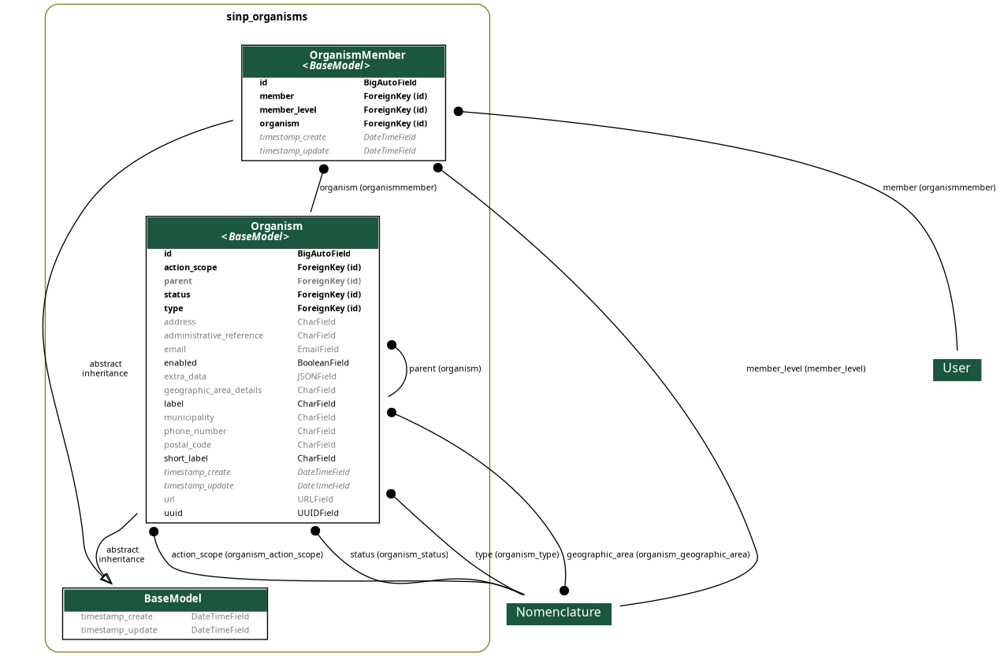

# SINP Organisms for Django

[DjangoSinpOrganisms](https://github.com/dbchiro/DjangoSinpOrganisms) is a simple [Django](https://www.djangoproject.com/) reusable app to manage [French SINP Organisms](http://standards-sinp.mnhn.fr/referentiel-des-organismes/), respecting standard.

See docs for more details : <https://dbchiro.github.io/DjangoSinpOrganisms/>

## Quick start

1. Install app

```bash
pip install -U dj-sinp-organisms
```

2. Configure `INSTALLED_APPS`:

```python
INSTALLED_APPS = (
    'django.contrib.admin',
    'django.contrib.auth',
    (...),
    'rest_framework',
    'sinp_nomenclatures',
    'sinp_organisms',
    (...),
)
```

3. Configure `urls.py`:

```python
urlpatterns = [
    path('admin/', admin.site.urls),
    path('api-auth/', include('rest_framework.urls')),
    (...),
    path('api/v1/', include('sinp_nomenclatures.urls')),
    path('api/v1/', include('sinp_organisms.urls')),
    (...),
]
```

4. Run `python manage.py migrate` to create the polls models.
5. Start the development server and visit <http://127.0.0.1:8000/admin/>
   to create an organism (you'll need the Admin app enabled).
6. Visit <http://127.0.0.1:8000/api/v1/organisms> to view organisms API.

## Database models


